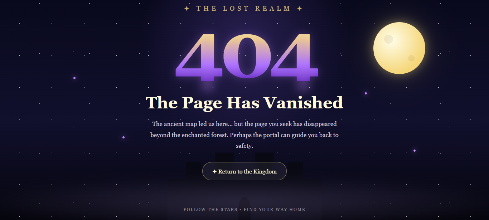

  

# 404: The Lost Realm 404

A fantasy-themed 404 error page featuring an immersive lost-realm design, interactive elements, animations, and responsive UI, built with HTML, CSS, and JavaScript.

## Features

- Fantasy-themed 404 interface
- Responsive design
- Custom animations and visual effects
- Interactive UI elements
- Custom HTML, CSS, and JavaScript implementation

## Built With

- HTML5
- CSS3
- JavaScript

## Live Demo

- [🌐 GitHub Pages](https://starvixhub.github.io/404-The-Lost-Realm-404/)
- [🎨 CodePen](https://codepen.io/editor/sinarezaei/pen/01a0df98-d273-7a1b-a0db-2e73d66132a2)

## License

This project is licensed under the MIT License.
